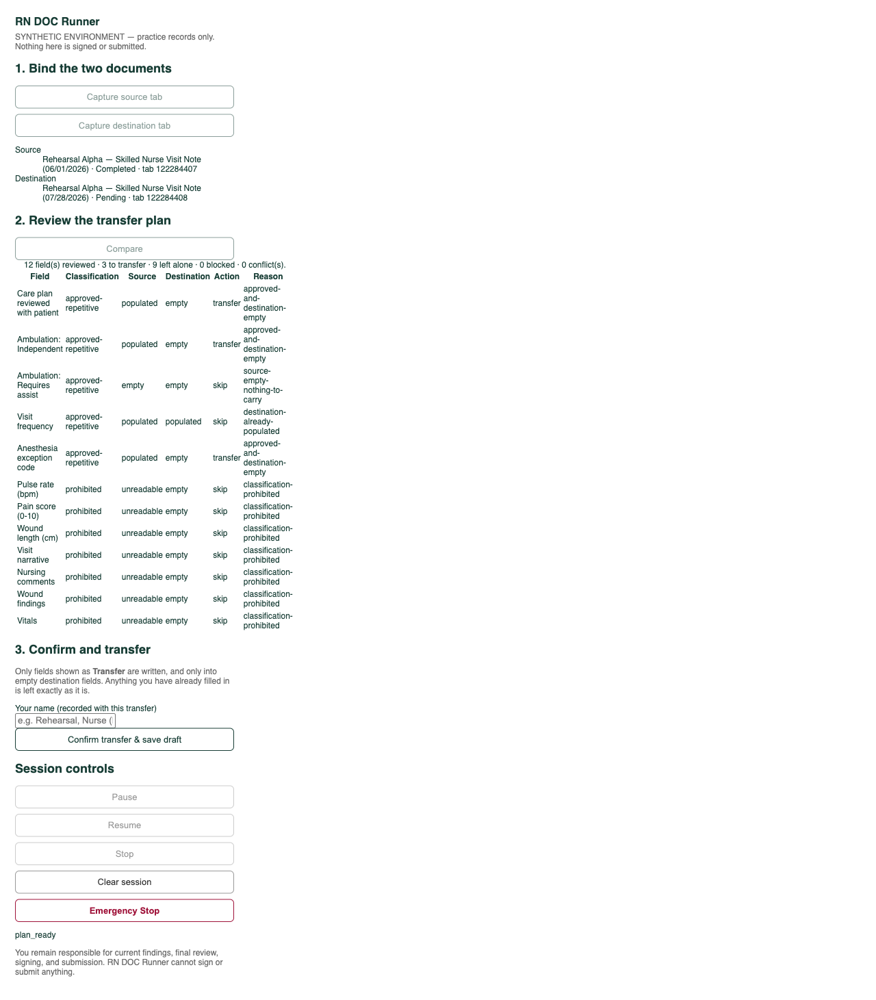
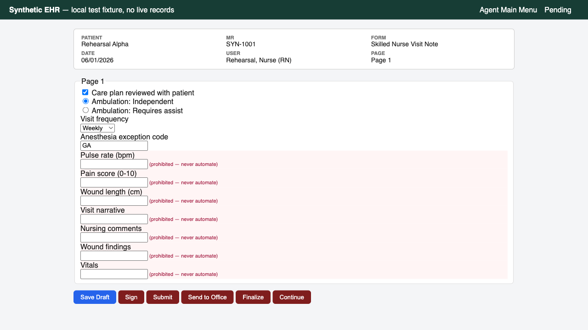
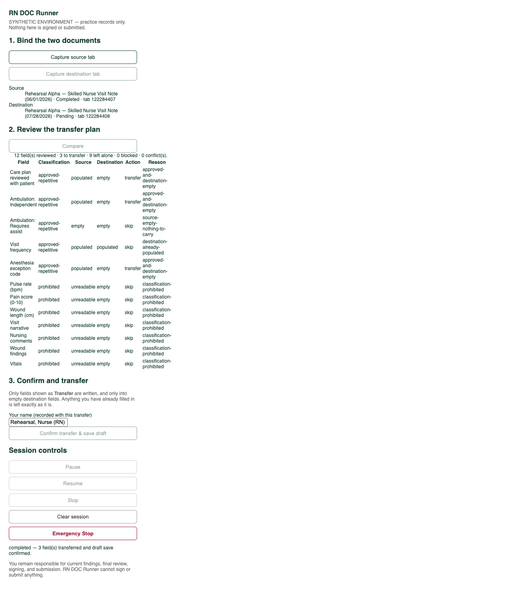

# RN DOC Runner

[](https://github.com/tarrellallen-dev/rn-doc-runner/actions/workflows/ci.yml)

A local-first macOS app and Chrome extension that automates the repetitive mechanics of nursing
documentation: finding the correct predecessor note, carrying forward RN-approved repeatable
selections, running configured date-update workflows, and saving a draft. The RN stays responsible for
every current clinical fact, the review, the signature, and the submission.

It calls no AI model. Every click it performs is refused unless the control's visible text and its
accessible name both match what the caller declared and neither reads as a finalization action. CI
fails the build if a shipped bundle reaches any destination other than loopback.

## What it looks like



<sub>The decision table, before anything is written. Every field is classified and given an explicit
action and reason. The five prohibited fields — pulse, pain score, wound length, narrative, comments,
findings, vitals — are all `skip / classification-prohibited`, and a field the destination already has
is `skip / destination-already-populated` rather than overwritten.</sub>



<sub>The bundled synthetic EHR that ships with the repo. Prohibited fields are shaded and labelled, and
the finalization controls (Sign, Submit, Send to Office, Finalize) exist specifically so the tests can
prove nothing ever clicks them.</sub>



<sub>Completed: 3 of 12 fields transferred, 9 left alone, 0 blocked, 0 conflicts. Emergency Stop is
available throughout. The draft is saved; signing and submission remain with the RN.</sub>

## Status and scope

I built this as a reference implementation, and I am publishing it as one.

Synthetic Development Mode is complete and tested end to end on macOS: 191 automated tests across
unit, integration, security, and end-to-end suites. Production Draft Mode against a real EHR is not enabled. The Devero adapter
ships `enabled: false` and `status: "UNCONFIGURED"`, with no selectors and an empty allowlist, and
turning it on requires a facility-approved training tenant, an RN-approved field allowlist, and
organizational sign-off. [docs/KNOWN_LIMITATIONS.md](docs/KNOWN_LIMITATIONS.md) covers what that means
in detail.

A few things worth stating plainly:

- This is not a medical device and not clinical decision support.
- No production EHR tenant has been validated. The only working adapters target a bundled synthetic
  EHR that ships with the repo.
- Live use requires facility authorization and a review of the EHR vendor's terms. See
  [docs/DEPLOYMENT_CHECKLIST.md](docs/DEPLOYMENT_CHECKLIST.md).
- Devero is a trademark of its owner. This project is not affiliated with or endorsed by them.
- Apache-2.0, without warranty of any kind. See [LICENSE](LICENSE).

## Running it yourself, and making it your own

Everything needed to run the full system is in this repo. There is no EHR to sign up for, no data
to supply, and no account to create. `npm run setup` builds it and runs the security scan;
`npm run synthetic-ehr:start` brings up a local Express app on port 4173 that stands in for the EHR,
serving forms populated from `synthetic-ehr/src/fixtures.ts`. Point the desktop app at it and you
have the whole pipeline — capture, compare, plan, apply, verify, save — running end to end against
records that never existed.

That makes this a sandbox you can take apart. The pieces are separated so you can replace one
without touching the others:

| Want to change | Edit |
|---|---|
| The UI | `apps/desktop/src/renderer/` — plain React and TSX, no component framework to fight |
| The fake EHR's forms, patients and layout | `synthetic-ehr/src/fixtures.ts` and `render.ts` |
| Which fields may be carried, per form version | `adapters/synthetic/src/*.ts` — an allowlist of labels and values |
| A different form or a different system | Write a new adapter against the `SiteAdapter` contract in `packages/contracts/` |
| The rules themselves | `packages/rules/src/rules.ts` — pure functions, no I/O, fully unit-tested |

The domain here is nursing documentation, but nothing in the architecture is nursing-specific. The
shape of the problem — carry approved fields from a prior record into a new one, refuse anything
outside the allowlist, fail closed on ambiguity, never touch the control that finalizes — is the
same for insurance forms, compliance filings, intake paperwork, or any workflow where the cost of a
wrong write is high and a human has to stay accountable for the result. Swap the adapters and the
fixtures and the engine does not care.

Two things to keep in mind if you fork it. The `SiteAdapter` allowlist is the safety boundary, so a
field you add there is a field the system will write — that is the one file worth reviewing
carefully. And running against anything real is a different question from running the sandbox: see
[docs/DEPLOYMENT_CHECKLIST.md](docs/DEPLOYMENT_CHECKLIST.md), which exists precisely because the
answer is not "just point it at your system."

## Safety model

Every mutation passes through exact-match identity verification on patient, MR, form, page, author,
and chronology. Fields are governed by an explicit per-form-version allowlist reviewed and approved by
the RN, and a prohibited-label check covers vitals, pain, wound, dose, route, medication, narrative,
and signature fields. Any ambiguity, selector drift, or contradiction fails closed and raises an
exception for review instead of guessing.

The safety properties are enforced by the build rather than by convention, and CI runs that
enforcement on every push:

- **One chokepoint for every click.** `packages/form-engine/src/verified-click.ts` resolves the
  selector, requires exactly one match, reads both the visible text and the accessible name
  (`aria-label`, `aria-labelledby`, `title`), and refuses if either matches the finalization pattern
  or fails to equal the label the call site declared. Adding a click without a label assertion is the
  unnatural thing to do.
- **Loopback or nothing.** The scan rejects any non-loopback URL literal in the shipped main and
  preload bundles, and refuses `sendBeacon` and `WebSocket` outright. The extension and renderer
  bundles may contain no network call at all.
- **No vacuous passes.** A missing or empty build artifact is a hard scan failure, not a silent skip.
- **The prohibited-field guard runs against real adapters.** A test discovers every field of every
  shipped allowlist by shape rather than by hardcoded name, so a prohibited field added to any adapter
  fails the suite.
- **The disabled adapter cannot be quietly enabled.** The scan rejects any `enabled: true` or any
  non-`UNCONFIGURED` status in that file, checking for absence rather than presence.

Details, including the guard's three known false positives and what the static scan cannot see, are in
[docs/SECURITY_MODEL.md](docs/SECURITY_MODEL.md).

## Workflow

```
Add worklist -> verify OCR queue -> Start Batch -> review completed drafts and exceptions
```

[docs/USER_GUIDE.md](docs/USER_GUIDE.md) is the RN-facing walkthrough.

## Quick start

```bash
npm run setup                                     # build everything, run the security scan
npm run synthetic-ehr:start                       # terminal 1
npm run start --workspace=@rn-doc-runner/desktop  # terminal 2
```

Load the extension from `extension/` at `chrome://extensions` with Developer mode on, using Load
unpacked. Full instructions in [docs/DEVELOPER_GUIDE.md](docs/DEVELOPER_GUIDE.md).

## Layout

```
apps/desktop/         Electron + React desktop app (main / preload / renderer)
extension/            Chrome MV3 extension (content script, background, popup)
native-host/          Chrome Native Messaging host bridging extension and desktop app
packages/
  contracts/          Zod schemas for every data shape in the system
  rules/              Deterministic rule engine: identity, chronology, allowlist, fail-closed
  form-engine/        Page read, compare, highlight, apply, save, red-link orchestration
  queue-engine/       Navigation, predecessor discovery, OCR queue construction, batch state machine
adapters/
  schema/             Adapter and calibration validators, plus the structural recorder
  synthetic/          Synthetic form adapters (SNV-v1, RECERT-v1) and site adapter
  devero-disabled/    Real EHR adapter, shipped disabled and unconfigured
synthetic-ehr/        Local Express app standing in for a real EHR during development
ocr-helper/           Swift / Apple Vision on-device OCR CLI and worklist-image generator
tests/                unit / integration / e2e / security
docs/                 User, developer, security, and process documentation
scripts/              Setup, uninstall, security scan, adapter validation
```

## Implementation notes

**OCR row reconstruction.** Apple Vision returns text observations in column-major order, so parsing
them in array order silently scrambles which date belongs to which patient. `reconstructRows` in
`packages/queue-engine/src/ocr/ocr-line-parser.ts` re-clusters observations by bounding-box Y-center
within a tolerance derived from median glyph height, which restores true reading order before any
parsing happens.

**Orientation handling.** A wrongly rotated page can score higher than the correct one, so scoring all
four rotations up front picks the wrong answer. `recognizeWithOrientationCorrection` trusts the
upright pass unless it returns fewer than three lines or mean confidence below 0.5, and only then
falls back to comparing rotations by confidence-weighted character count.

**Batch state machine.** `packages/queue-engine/src/batch-machine.ts` handles pause, resume, and
emergency stop per entry, with checkpointing so an interrupted run resumes where it stopped rather
than restarting or double-writing.

**Nothing leaves the machine.** OCR runs on-device through Apple Vision. Worklist imports are read
from their original location and never copied into the repo. PDF previews render to the OS temp
directory and are deleted immediately after use. The extension manifest sets `connect-src 'none'`.

## Documentation

- [docs/USER_GUIDE.md](docs/USER_GUIDE.md) — the three-action RN workflow
- [docs/DEVELOPER_GUIDE.md](docs/DEVELOPER_GUIDE.md) — build, run, and test locally
- [docs/SECURITY_MODEL.md](docs/SECURITY_MODEL.md) — what is enforced, and how
- [docs/ADAPTER_CALIBRATION.md](docs/ADAPTER_CALIBRATION.md) — Calibration Mode and adapter approval
- [docs/FORM_MATRIX_GUIDE.md](docs/FORM_MATRIX_GUIDE.md) — writing a form-version field allowlist
- [docs/TESTING.md](docs/TESTING.md) — running and extending the test suite
- [docs/DEPLOYMENT_CHECKLIST.md](docs/DEPLOYMENT_CHECKLIST.md) — the gate before any live use
- [docs/RECOVERY.md](docs/RECOVERY.md) — crash and resume, retention, emergency stop
- [docs/KNOWN_LIMITATIONS.md](docs/KNOWN_LIMITATIONS.md) — what is not done
- [docs/PRIVACY_AUDIT.md](docs/PRIVACY_AUDIT.md) — repository and history audit
- [docs/BUILD_REPORT.md](docs/BUILD_REPORT.md) — milestone-by-milestone status

## License

Apache-2.0. See [LICENSE](LICENSE) and [NOTICE](NOTICE). Built by Tarrell Allen.
